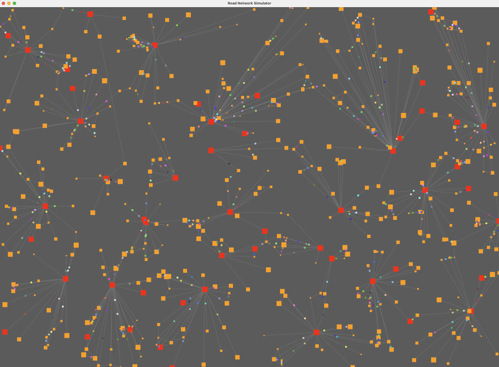

## Introduction
Rust + Bevy ECS simulation of a road network with NPCs moving around on a 2 sec interval.

- https://www.rust-lang.org/
- https://bevyengine.org/

The world generator assigns 5% of the settlements to be hubs. Some settlements in each cluster
then connects to some other cluster to form one connected graph.

## Run
Clone and make sure you have Rust installed. Ie. on MAC

    $ brew install rust

Then:

    $ cargo run

## Screenshot
Showing 500 settlements and 500 NPCs moving between settlements.

## TODO
No performance optimizations or profiling made at all. Performance breaks down (on my MAC) at around 10000 settlements.

Would be fun to optimize and load all cores/GPU to the maximum and see how large a simulation could be driven.
