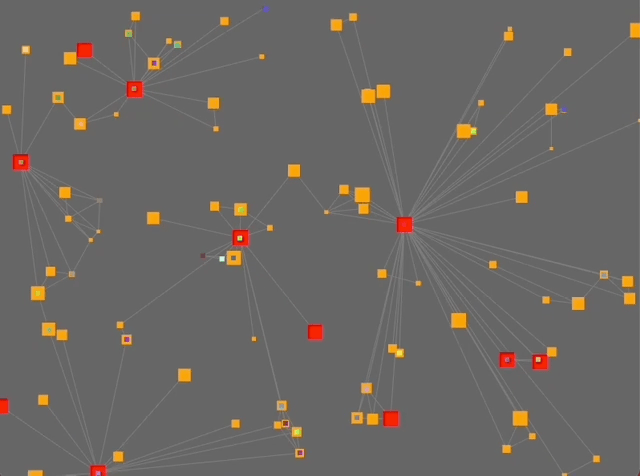
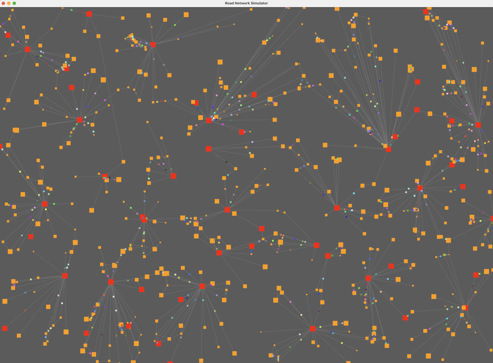

## TL/DR
Mini project to get a feel for game development using Rust + Bevy.

The "game" is an ECS simulation of a road network with NPCs moving around on a 2 sec interval.

- https://www.rust-lang.org/
- https://bevyengine.org/

The world generator assigns 5% of the settlements to be hubs. Some settlements in each cluster
then connects to some other cluster to form one connected graph.

The focus of this project has been on clean architecture, separation of concerns, scalability,
and learning modern Rust patterns—especially around ECS, real-time simulation, and rendering pipelines.

## Demo
A small animated gif showing what the simulation looks like.

Screenshot showing 500 settlements and 500 NPCs.

## Run
Clone and make sure you have Rust installed. Ie. on MAC

    $ brew install rust

Then:

    $ cargo run

Or:

    $ cargo run -- --help
    Road Network Simulator CLI
    
    Usage: road_network [OPTIONS]
    
    Options:
    --settlements <SETTLEMENTS>              Number of settlements [default: 100]
    --npcs <NPCS>                            Number of NPCs [default: 50]
    --npc-move-interval <NPC_MOVE_INTERVAL>  NPC move interval in seconds [default: 2]
    --width <WIDTH>                          Window width [default: 800]
    --height <HEIGHT>                        Window height [default: 600]
    -h, --help                                   Print help
    -V, --version                                Print version

For example, you can do:

     $ cargo run -- --settlements 2000 --npcs 1000 --npc-move-interval 1.0 --width 1600 --height 1200

## What I learned
Got a feel for 

- The Rust programming language.
- Cargo, library dependencies.
- How a Rust application in general is structured, modules, crates.
- How to structure an ECS application using Bevy.
- How to model a simple game simulation for ECS execution.
- Misc: camera, sprites, tween etc.

## Core Concepts & Design Philosophy
At its heart, the simulator embraces two major paradigms:

**Entity-Component-System (ECS):**

- Using Bevy's ECS, we separate data (components) from behavior (systems).

- Every element in the simulation—settlements, roads, NPCs, visuals—is represented as entities composed of lightweight components.

- Systems operate over queries, ensuring modular and efficient logic.

**Separation of Simulation and Representation:**

- The simulation logic (the "world state") is entirely decoupled from how it's rendered.

- Logical entities store only what they need (e.g., positions, population, movement state).

- Visual entities (sprites) are managed separately and synchronized with simulation data through dedicated systems.

This design ensures flexibility, scalability, and clarity, making it easy to expand the project with new features like AI behavior, UI overlays, or more complex navigation algorithms.

## Performance
No performance optimizations or profiling made at all. Performance breaks down (on my machine) at around 10000 settlements.

CPU cores was not loaded at all so was maybe a rendering queue (no batching I believe) choke?

Would be interesting and fun to investigate and optimize to load all cores/GPU to the maximum and see how large a
simulation could be driven.

## TODO
- Performance optimizations (batching, improved road generation).
- Goal oriented NPC behaviour.
- User interaction (game ideas).
- Displaying simulation data.
- Allow simulation speed adjustments, spawning/killing NPCs etc runtime.
